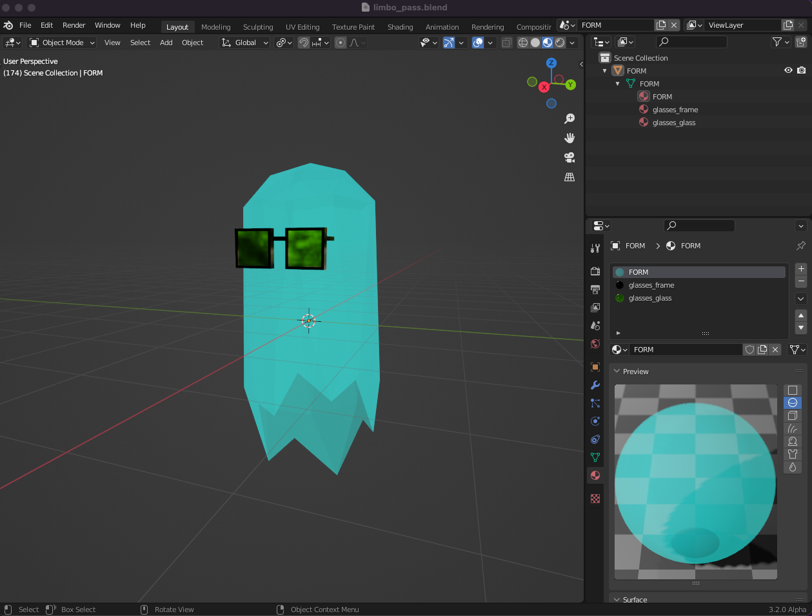
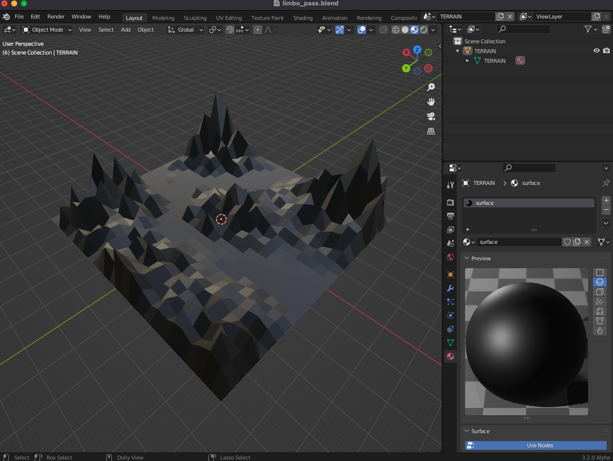
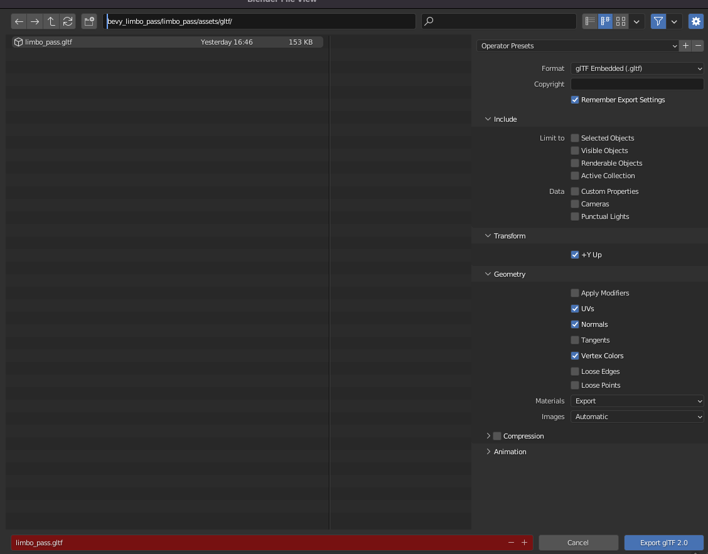

# limbo pass

a little game, limbo on a mountain pass


## run the game

build / run with the **release** flag so the overworld theme loads on time :)

```sh
cargo run --release
```

## run on the web (WASM)

First, install the WASM target and wasm-server-runner:

```sh
rustup target install wasm32-unknown-unknown
cargo install wasm-server-runner
```

Then run from the project root:

```sh
cargo run --target wasm32-unknown-unknown --release --bin limbo_pass
```

Or from the `limbo_pass` directory:

```sh
cd limbo_pass
cargo run --target wasm32-unknown-unknown --release
```

This will automatically start a local web server and open the game in your browser.

## deploy to cloudflare pages

First, install wasm-bindgen-cli:

```sh
cargo install wasm-bindgen-cli --version 0.2.106
```

Then build for production:

```sh
./build.sh
```

This creates a `dist/` directory with all the files needed for deployment.

### Cloudflare Pages Setup

1. **Connect your repository** to Cloudflare Pages:
   - Go to [Cloudflare Dashboard](https://dash.cloudflare.com/) → Workers & Pages → Create application → Pages → Connect to Git
   - Select your repository

1. **Configure build settings**:
   - **Build command**: `bash build.sh`
   - **Build output directory**: `limbo_pass/dist`

1. **Deploy**: Cloudflare Pages will automatically build and deploy on every push to your main branch.

Alternatively, you can deploy manually using Wrangler:

```sh
npm install -g wrangler
wrangler pages deploy limbo_pass/dist
```

## wander

- space bar
- ← ↑ ↓ →
- w a s d

## look

- hold ctrl and move the mouse to orbit the camera around the scene
- scroll to zoom
- secondary click / right click for a slow camera pan

## about

- limbo pass was written with rust, bevy, and the amazing bevy plugins bevy_kira_audio, bevy_rapier3d, and smooth-bevy-cameras. the scene was modled in blender 3.2.0 alpha
- the overworld theme was made on an op-1, using the the deep space string synthesizer and tombola sequencer - then post processed with ffmpeg. if you just want to hear the theme, it's also listenable on [soundcloud](https://soundcloud.com/wanderball)

## why

mostly this little game was me figuring out how to use blender assets in bevy and then how to make the ghost's movement respect the surfaces of the terrain. i drew a lot of inspiration and owe a lot of lightbulb moments to the @sdfgeoff projects [blender_bevy_toolkit](https://github.com/sdfgeoff/blender_bevy_toolkit) and [blender_bevy_top_down_space_shooter](blender_bevy_top_down_space_shooter).

## blender

some details on implementation on the blender side. in case you're curious or looking for examples of how to do this sort of stuff yourself like i was at every step of the way.

- the scenes used for this project live in `blend/limbo_pass.blend` and are exported to `limbo_pass/assets/gltf/limbo_pass.gltf`
- this project gets both scenes and the terrain mesh by name so make sure you keep track of those :)
- the ghost's origin is somewhere near the object's center of mass but I toggled it a bit. on the bevy / rapier3d side, the scene shares a transform with a sphere collider and because the ghost's shape is irregular it needed a bit of adjusting to match the collider's vertical area
- i ended up doing some... cursed looking things i probably didn't have to to get the terrain's vertices and indexes for the trimesh collider, if you can point me at a better solution I'd be glad for it :)
- i left this commented out in the main function, it was very helpful when developing colliders to see them rendered `.add_plugin(RapierDebugRenderPlugin::default())`






